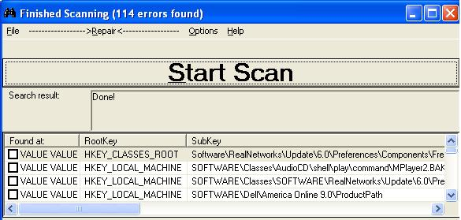



## Registry Duster 2\.0 Beta

### Description

Scans your computer for registry errors and removes them. I don't know why but the last time I tried to improve Registry Duster 1.0, everyone told me that it didn't work. I tried backtracking to see what was wrong. I'm not sure if I fixed the problems, but it works for me. I'm not done finished with this project yet, so I need as many improvements and fixes as possible. KEEP GIVING ME RATINGS, IMPROVEMENTS, AND COMMENTS NO MATTER HOW LONG I HAVE HAD THIS PROJECT UPLOADED!
 
### More Info
 

             |
---                |---
**Submitted On**   |2005-07-24 14:11:34
**By**             |[VB Beginner](https://github.com/Planet-Source-Code/PSCIndex/blob/master/ByAuthor/vb-beginner.md)
**Level**          |Beginner
**User Rating**    |4.7 (14 globes from 3 users)
**Compatibility**  |VB 6\.0
**Category**       |[Miscellaneous](https://github.com/Planet-Source-Code/PSCIndex/blob/master/ByCategory/miscellaneous__1-1.md)
**World**          |[Visual Basic](https://github.com/Planet-Source-Code/PSCIndex/blob/master/ByWorld/visual-basic.md)
**Archive File**   |[Registry\_D1917007242005\.zip](https://github.com/Planet-Source-Code/vb-beginner-registry-duster-2-0-beta__1-61824/archive/master.zip)

